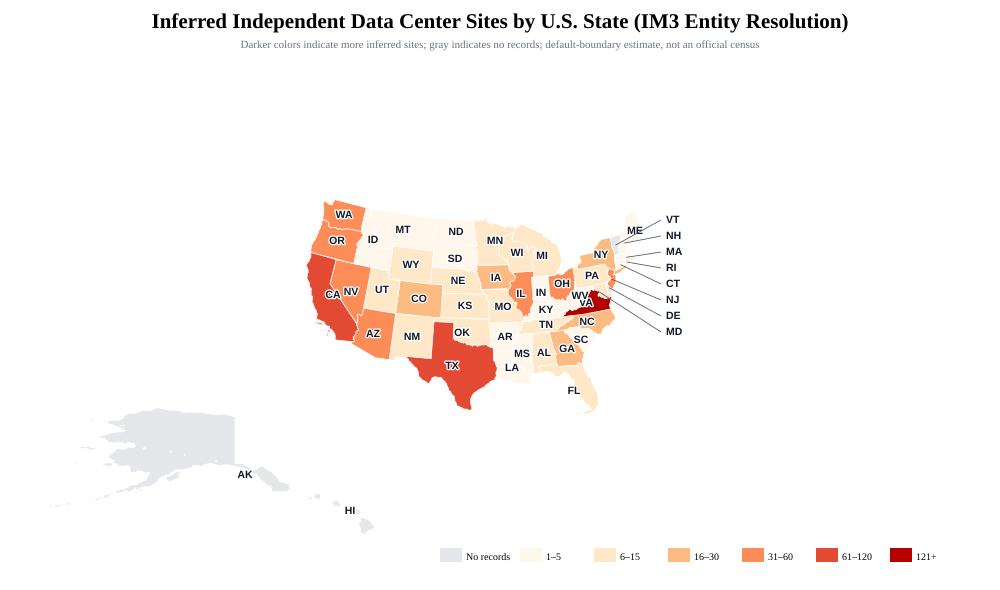
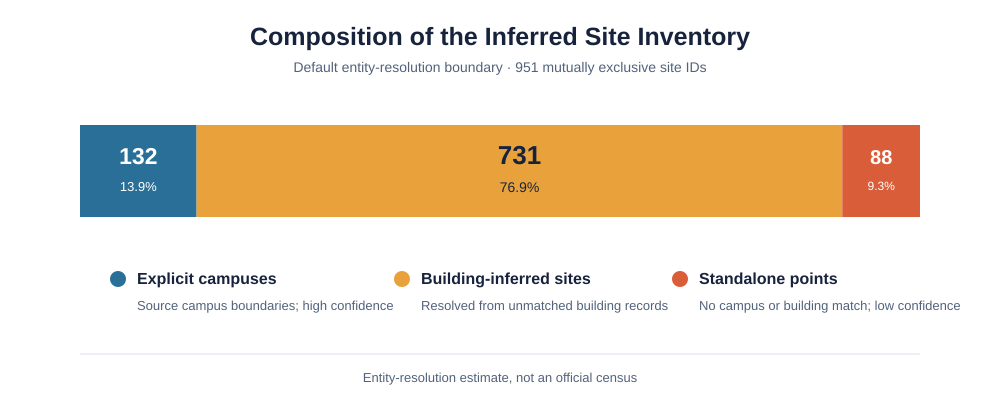
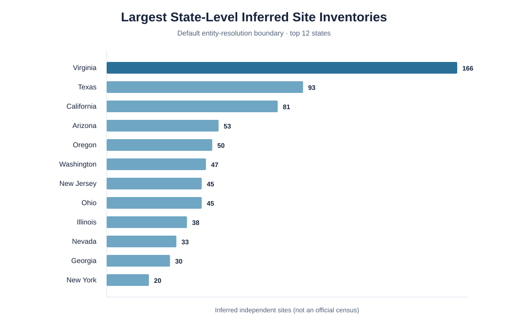
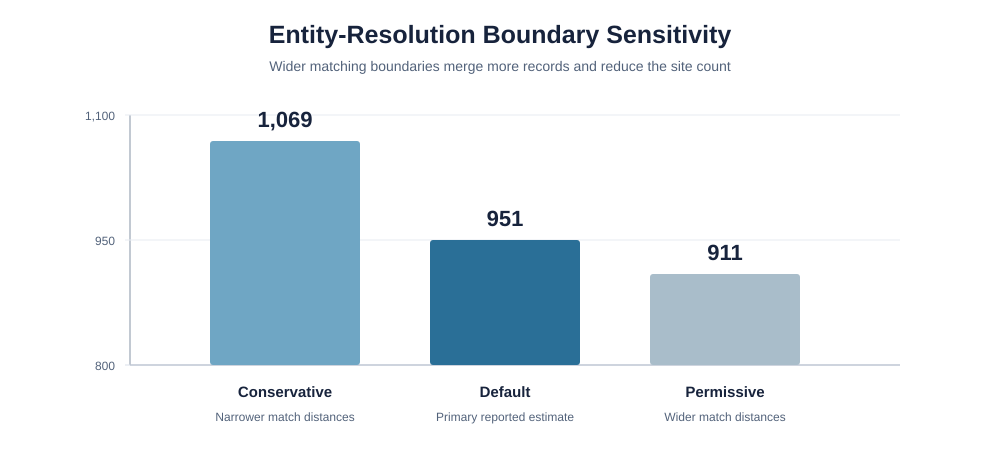
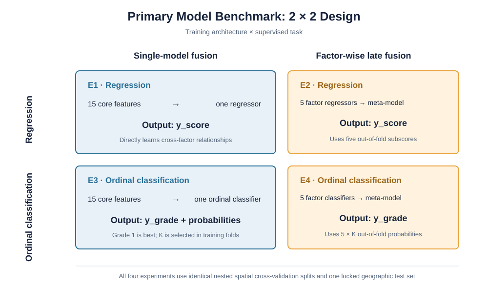

# Principal Factor: U.S. Data Center Siting

> A reproducible dataset and modeling proposal for evaluating U.S. data center locations under power, water, network, land, and cost constraints.

**Research status:** Proposal · **Geographic scope:** 50 U.S. states · **Snapshot:** August 22, 2026

This repository defines an observable feature schema, an entity-resolved site inventory, non-compensatory feasibility rules, and a controlled machine-learning benchmark. It aligns the first-version variables with the [IM3 Open Source Data Center Atlas](https://github.com/IMMM-SFA/datacenter-atlas) and [CERF Data Centers](https://github.com/IMMM-SFA/cerf_data_centers). It does **not** report fabricated or preliminary model accuracy.

## Research at a glance

| Quantity | Value | Interpretation |
|---|---:|---|
| U.S. states in scope | 50 | District of Columbia and Puerto Rico are excluded |
| States with source records | 45 | Missing records do not imply that no data center exists |
| Inferred independent sites | 951 | Default entity-resolution estimate, not an official census |
| Core model features | 15 | Observable and aligned with IM3/CERF-DC calculations |
| Hard feasibility rules | 13 | Applied before model scoring and never offset by high scores |
| Primary benchmark experiments | 4 | Two architectures × two supervised tasks |

## 1. U.S. site distribution

The IM3 location file contains parallel `point`, `building`, and `campus` layers without a shared project-level primary key. The map therefore counts mutually exclusive inferred `site_id` entities rather than adding raw layer records.

<p align="center">
  
</p>

<p align="center"><em>Figure 1. Inferred independent sites under the default spatial and identity-matching boundaries.</em></p>

Virginia is the largest cluster in the resolved inventory. This concentration is also the reason random train/test splitting is inappropriate: neighboring observations share infrastructure, markets, climate, and regulatory conditions.

## 2. Entity-resolution evidence

The default inventory contains three mutually exclusive site types. Explicit campus polygons receive the highest confidence; unmatched buildings and points are resolved conservatively when project identity is uncertain.

<p align="center">
  
</p>

<p align="center"><em>Figure 2. Composition of the 951 inferred independent sites.</em></p>

The distribution is geographically concentrated rather than uniform.

<p align="center">
  
</p>

<p align="center"><em>Figure 3. The twelve largest state-level inferred site inventories.</em></p>

Entity counts depend on explicit matching boundaries. Wider name, operator, and distance thresholds merge more records and therefore reduce the inferred total.

<p align="center">
  
</p>

<p align="center"><em>Figure 4. Sensitivity of the national site count to entity-resolution boundaries.</em></p>

The complete rules, distance thresholds, state table, and confidence definitions are documented in [`01_us_site_inventory_and_feature_schema.ipynb`](notebooks/01_us_site_inventory_and_feature_schema.ipynb).

## 3. Core feature schema

The first training dataset retains 15 observable features and excludes identifiers, composite outcomes, and duplicated derived quantities.

| Factor | Representative measurements | Why it enters the model |
|---|---|---|
| Power | IT load, PUE, substation distance, transmission voltage | Measures facility demand and physical interconnection conditions |
| Water and cooling | Water-cooling fraction, municipal service-area distance | Measures cooling design and public-water accessibility |
| Network | Symmetric 1 Gbps provider count, high-speed fiber distance | Measures commercial network reach and provider diversity |
| Land and construction | Campus area, contiguous feasible area, slope, developed-land proximity | Measures whether a project can be built as a contiguous campus |
| Cost and market | Land cost, electricity rate, tax rates, market distance | Measures location-dependent operating and capital conditions |

Availability class **A** indicates a clearly defined nationwide public layer or a verifiable project field. Class **B** indicates an obtainable variable that requires local records, project documents, geospatial processing, or unit harmonization. Missing values remain missing rather than being replaced with subjective weights.

## 4. Hard feasibility gate

H1–H13 screen airports, waterbodies, slope, sinkholes, flood risk, parks and cemeteries, infrastructure distance, protected land, transportation rights-of-way, military areas, and developed-land restrictions.

These fields generate feasible candidates; they are not ordinary compensatory features. A site that fails a hard rule is excluded before regression or classification, even if the remaining model inputs are favorable.

## 5. Modeling benchmark

Two architectures are evaluated under two supervised formulations. All four experiments use identical nested spatial cross-validation folds and one locked geographic test set.

<p align="center">
  
</p>

<p align="center"><em>Figure 5. Primary 2 × 2 benchmark design.</em></p>

### Targets

- **Regression:** predict continuous recommendation score `y_score`; higher is better.
- **Ordinal multiclass classification:** predict `y_grade ∈ {1,…,K}`; grade 1 is best and `K=3/4/5` is selected inside training folds.

### Candidate models

- **Machine learning:** Elastic Net, GAM, SVR, Random Forest, Extra Trees, XGBoost, LightGBM, CatBoost, and ordinal logistic regression.
- **Deep learning:** MLP, TabNet, and FT-Transformer; ordinal versions use CORAL or CORN losses.
- **Late-fusion meta-models:** Ridge, Elastic Net, LightGBM, CatBoost, a small MLP, ordinal logistic regression, and CORAL-MLP.

Regression is selected primarily by outer-fold MAE; ordinal classification is selected by QWK and grade MAE. The best regression and classification models are reported separately and need not use the same algorithm. The IM3/CERF-DC rule score remains a shared external reference baseline, not a fifth experiment.

## 6. Repository structure

```text
.
├── README.md
├── figures/
│   ├── entity-resolution-sensitivity.svg
│   ├── model-benchmark-matrix.svg
│   ├── site-inventory-composition.svg
│   ├── top-state-site-counts.svg
│   └── us-site-distribution.svg
├── notebooks/
│   ├── 01_us_site_inventory_and_feature_schema.ipynb
│   └── 02_modeling_and_benchmark_design.ipynb
└── data/
    ├── README.md
    └── raw/
        ├── im3_us_data_center_locations.gpkg
        └── us_states_2025.geojson
```

The numbered notebooks separate data definition from modeling decisions:

1. [`01_us_site_inventory_and_feature_schema.ipynb`](notebooks/01_us_site_inventory_and_feature_schema.ipynb) documents entity resolution, the state map, 15 core features, and H1–H13.
2. [`02_modeling_and_benchmark_design.ipynb`](notebooks/02_modeling_and_benchmark_design.ipynb) documents factor-wise submodels, candidate algorithms, leakage controls, metrics, and the four primary experiments.

## 7. Reproducibility

The executable inventory cell uses only the Python standard library (`pathlib` and `sqlite3`) and expects execution from `notebooks/`. Its relative path resolves the included GeoPackage at `../data/raw/im3_us_data_center_locations.gpkg`.

The cell reproduces the simple source-layer count of 1,471 distinct IDs across 45 states. The reported 951-site inventory additionally applies the documented cross-layer entity-resolution procedure; the two quantities have different meanings and must not be interchanged.

## 8. Data provenance

See [`data/README.md`](data/README.md) for source, role, and reuse notes. Principal upstream sources include:

- [IM3 Open Source Data Center Atlas](https://github.com/IMMM-SFA/datacenter-atlas)
- [CERF Data Centers](https://github.com/IMMM-SFA/cerf_data_centers)
- [IM3 Projected U.S. Data Center Locations](https://www.osti.gov/biblio/2571680)
- FCC Broadband Data Collection
- USGS Public Supply Service Areas
- HIFLD/GeoPlatform, NLCD, and Census TIGERweb

## 9. Limitations

- Site counts depend on explicit entity-resolution boundaries and require sampled manual review.
- Distance to infrastructure does not establish spare electric, water, or network capacity.
- Several project-specific features require permits, utility opinions, or local tax and parcel records.
- A valid supervised model still requires defensible outcome or expert labels collected independently of model inputs.
- If grades are discretized from `y_score`, the cut points must be fitted inside training folds and cannot provide an independent validation target.

No license is asserted for third-party source data in this repository. Users should review the original providers' attribution, licensing, and redistribution terms before reuse.
