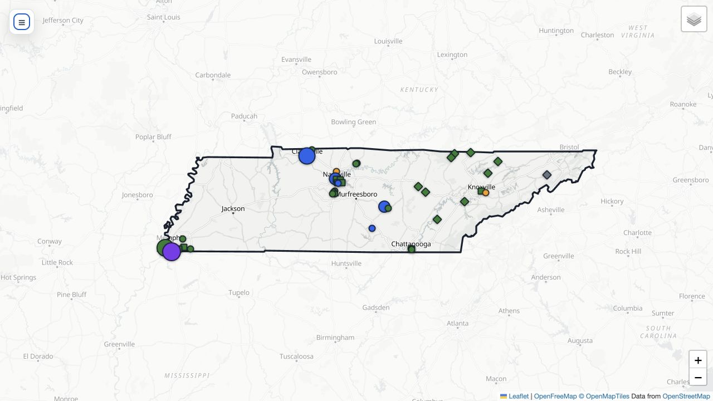

# Tennessee Data Center Research

> Current geographic focus: Tennessee

This project maintains a public Tennessee data-center inventory, an interactive facility map, and a state-level spatial-analysis framework. The Tennessee workflow is kept separate from the broader national research materials in [`../DCUS/`](../DCUS/).

## Current Snapshot

Snapshot checked: September 4, 2026.

- **61 Master records**: 50 core data-center or interconnection records and 11 crypto-mining records.
- **16 candidate sites**: tracked separately from confirmed Master records.
- **13 mappable candidates**: candidate records with both latitude and longitude.

Unknown values remain blank rather than being estimated. Candidate sites do not change confirmed-facility counts.

## Interactive Map

[Open the Tennessee data-center map](Map/tennessee_dcmap.html).



*The image is a static preview. Use the interactive HTML map for the latest records, filters, facility details, and evidence links.*

See [`Map/README.md`](Map/README.md) for source attribution, the map legend, control instructions, and interpretation notes.

## Directory Contents

```text
TN/
├── README.md
├── Tennessee_spatial_analysis.md
├── dataset/
│   ├── tennessee_public_data_centers.xlsx
│   └── Tennessee Data Center Dataset Update and Compatibility Specification.md
└── Map/
    ├── README.md
    ├── tennessee_dcmap.html
    ├── tennessee_dcmap_preview.png
    ├── TN_DC_Map_Generator.ipynb
    └── template/
        └── TN_dcmap_template.html
```

### Research and analysis

- [`Tennessee_spatial_analysis.md`](Tennessee_spatial_analysis.md) defines the research questions, analytical scope, spatial methods, and validation strategy.

### Dataset

- [`dataset/tennessee_public_data_centers.xlsx`](dataset/tennessee_public_data_centers.xlsx) contains the normalized Master inventory, candidate sites, source-aligned records, audits, and change history.
- [`dataset/Tennessee Data Center Dataset Update and Compatibility Specification.md`](dataset/Tennessee%20Data%20Center%20Dataset%20Update%20and%20Compatibility%20Specification.md) defines the schema and update rules.

### Map

- [`Map/README.md`](Map/README.md) provides source attribution, the legend, controls, and interpretation guidance.
- [`Map/tennessee_dcmap.html`](Map/tennessee_dcmap.html) is the generated interactive map.
- [`Map/TN_DC_Map_Generator.ipynb`](Map/TN_DC_Map_Generator.ipynb) generates the map from the workbook.
- [`Map/template/TN_dcmap_template.html`](Map/template/TN_dcmap_template.html) contains the map interface, styles, and filtering logic.
- [`Map/tennessee_dcmap_preview.png`](Map/tennessee_dcmap_preview.png) is the static repository preview.

## Updating the Map

Update the workbook first, preserve source URLs and stable IDs, and record material changes in `Change_Log`. Run `TN_DC_Map_Generator.ipynb` from `TN/Map/` to regenerate `tennessee_dcmap.html`.

## Scope

These files are active research artifacts based on publicly identifiable records. Coverage is not guaranteed to be complete. Facility status, ownership, capacity, and coordinates should be checked against the recorded evidence before publication or detailed spatial analysis.
